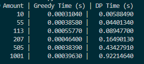

# Жадібні алгоритми та динамічне програмування

Вітаємо в домашньому завданні до теми “Жадібні алгоритми та динамічне програмування”! 🙂

Вивчення жадібних алгоритмів та алгоритмів динамічного програмування разом із практичним досвідом розв'язання завдань допоможе вам покращити свою майстерність у сфері оптимізації та аналізу алгоритмів.

Під час виконання цього домашнього завдання:

- ви зможете поглибити свої знання та розуміння в реалізації жадібних алгоритмів та алгоритмів динамічного програмування;
- отримаєте можливість застосувати теоретичні знання на практиці: розробка функцій жадібного алгоритму та алгоритму динамічного програмування дозволить вам легше розуміти їхню реальну природу та застосування;
- через порівняння ефективності двох різних методів розв’язання одного завдання ви навчитесь проводити об'єктивний аналіз та розуміти, який метод може бути ефективнішим у конкретних умовах.

Бажаємо успіхів та нехай код буде з вами! 🚗✨

## Опис домашнього завдання

У конспекті ми розглянули приклад про розбиття суми на монети. Маємо набір монет `[50, 25, 10, 5, 2, 1]`. Уявіть, що ви розробляєте систему для касового апарату, яка повинна визначити оптимальний спосіб видачі решти покупцеві.

Вам необхідно написати дві функції для касової системи, яка видає решту покупцеві:

1. Функція жадібного алгоритму `find_coins_greedy`. Ця функція повинна приймати суму, яку потрібно видати покупцеві, і повертати словник із кількістю монет кожного номіналу, що використовуються для формування цієї суми. Наприклад, для суми 113 це буде словник `{50: 2, 10: 1, 2: 1, 1: 1}`. Алгоритм повинен бути жадібним, тобто спочатку вибирати найбільш доступні номінали монет.

2. Функція динамічного програмування `find_min_coins`. Ця функція також повинна приймати суму для видачі решти, але використовувати метод динамічного програмування, щоб знайти мінімальну кількість монет, необхідних для формування цієї суми. Функція повинна повертати словник із номіналами монет та їх кількістю для досягнення заданої суми найефективнішим способом. Наприклад, для суми 113 це буде словник `{1: 1, 2: 1, 10: 1, 50: 2}`

Порівняйте ефективність жадібного алгоритму та алгоритму динамічного програмування, базуючись на часі їх виконання або О великому та звертаючи увагу на їхню продуктивність при великих сумах. Висвітліть, як вони справляються з великими сумами та чому один алгоритм може бути більш ефективним за інший у певних ситуаціях. Свої висновки додайте у файл `readme.md` домашнього завдання.

## Підготовка та завантаження домашнього завдання

1. Створіть публічний репозиторій `goit-algo-hw-09`.
2. Виконайте завдання та відправте його у свій репозиторій.
3. Завантажте робочий файл на свій комп’ютер та прикріпіть його у `LMS` у форматі `zip`. Назва архіву повинна бути у форматі `ДЗ9_ПІБ`.
4. Прикріпіть посилання на репозиторій `goit-algo-hw-09` та відправте на перевірку.

## Формат здачі

- Прикріплений файл репозиторію у форматі `zip` з назвою `ДЗ9_ПІБ`.
- Посилання на репозиторій.

## Критерії прийняття ДЗ

- Прикріплені посилання на репозиторій `goit-algo-hw-09` та безпосередньо сам файл репозиторію у форматі `zip`.
- Програмно реалізовано функцію, яка використовує принцип жадібного алгоритму. Код виконується і повертає словник з кількістю монет кожного номіналу, що використовуються для формування певної суми. Спочатку вибираються найбільш доступні номінали монет.
- Програмно реалізовано функцію, яка використовує принцип динамічного програмування. Код виконується і повертає словник з номіналами монет та їх кількістю для досягнення заданої суми найефективнішим способом.
- На основі оцінювання часу виконання кожного з двох алгоритмів або О великого визначено найбільш ефективний при великих сумах алгоритм.
- Зроблено висновки щодо ефективності алгоритмів для даного випадку. Висновки оформлено у вигляді файлу `readme.md` домашнього завдання.

#### Висновки:

Жадібний алгоритм ефективний і швидкий, але не є оптимальним для всіх наборів монет.

Алгоритм динамічного програмування завжди знаходить оптимальне рішення, але є повільнішим, бо час виконання збільшується пропорційно сумі, яку потрібно розбити на монети, та кількості номіналів монет.
